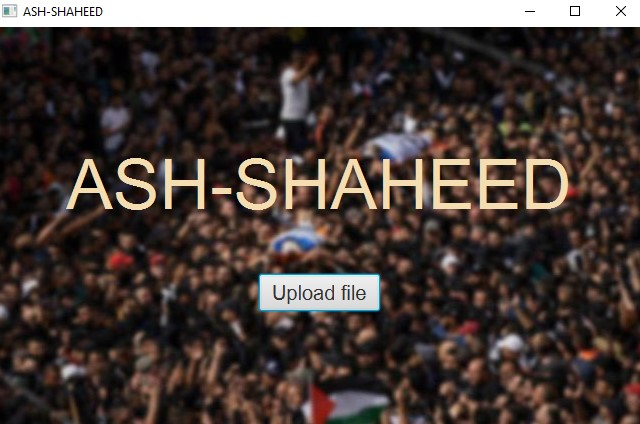
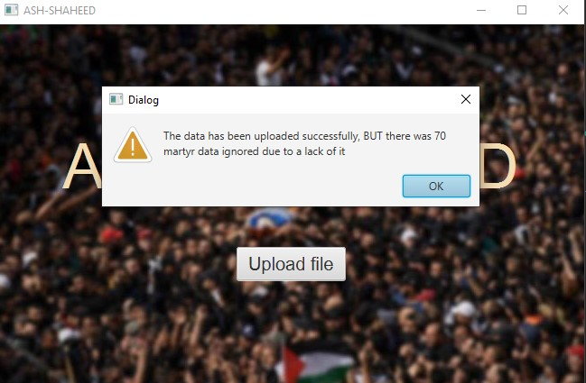
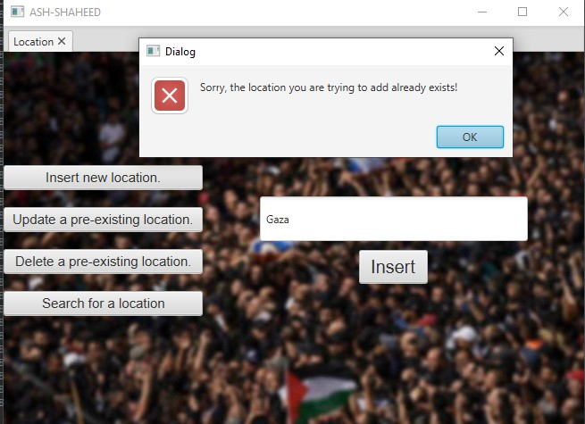
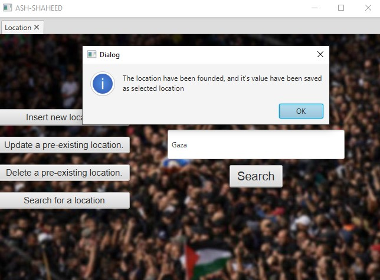
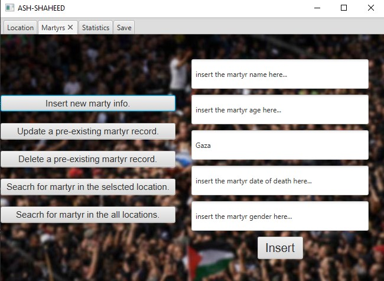
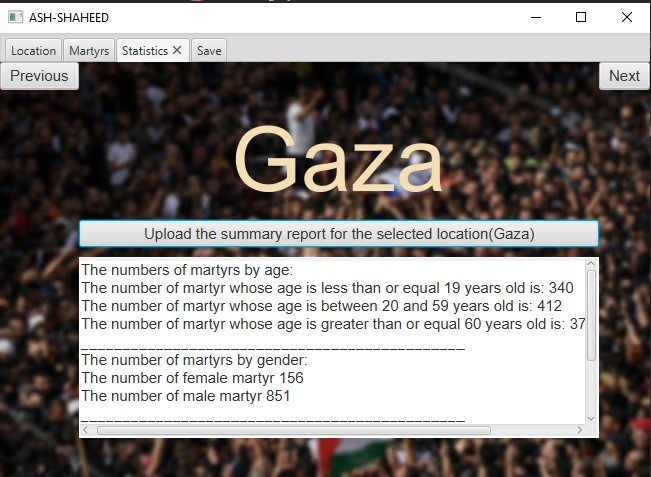

# 🌟 ASH-SHAHEED 🌟

**ASH-SHAHEED** is a comprehensive tool designed to manage and display martyr data efficiently. 

## 🔧 Data Structures

The ASH-SHAHEED system uses an efficient linked list architecture:

- **Doubly Linked List:** Manages different locations. Each node represents a location and contains a Singly Linked List.
- **Singly Linked List:** Holds martyr data specific to each location. This approach allows for efficient traversal and management of both locations and martyr records.

## 💻 Main Interface

The main interface provides a simple option to upload martyr data for processing.

## 🚨 Data Upload Notification

The notification indicates successful data upload, though some records might be ignored due to incomplete data.

## 🌍 Location Information Management

Users can:

- Insert new location information
- Update or delete existing locations
- Search for locations

## 📋 Martyr Information Management

Users can:

- Insert new martyr information
- Update or delete existing records
- Search by location

## 📊 Martyr Statistics

View summary statistics for selected locations, including:

- Martyr counts by age and gender
- Average age of martyrs
- Date with the maximum number of martyrs
- Percentage of martyrs in Gaza compared to the total

## 💾 Save Martyr File

Users can save martyr information to a file for future reference.
